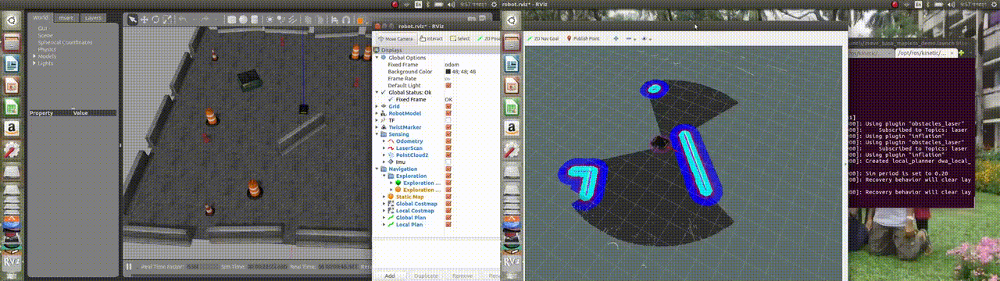
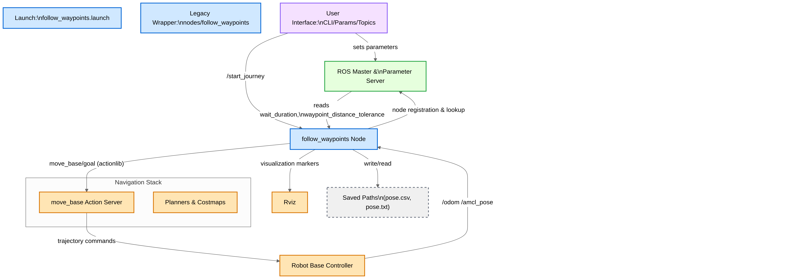
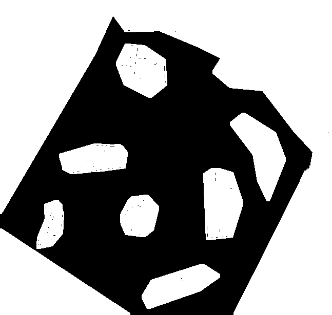
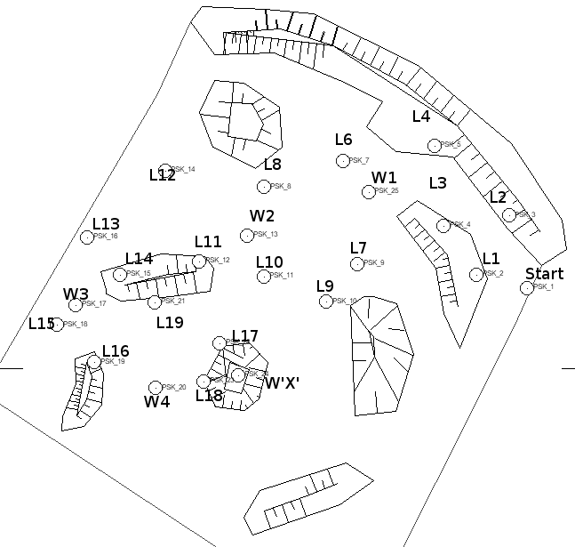
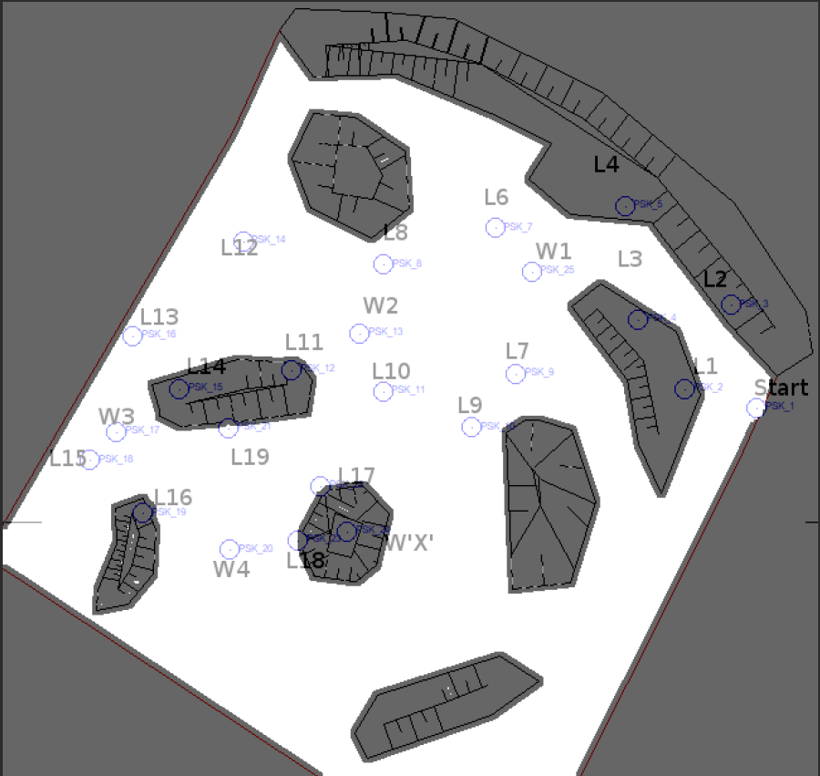
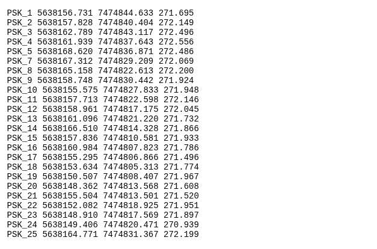
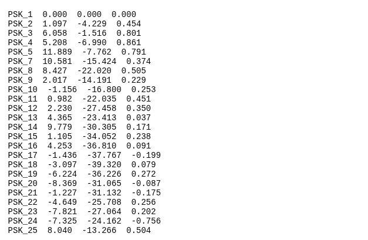
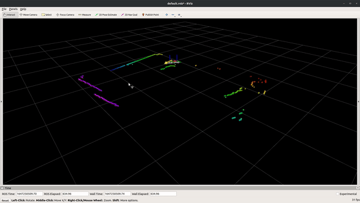

# Waypoint-Based 2D Navigation for ROS Robots

This ROS package enables robots to autonomously navigate through predefined 2D waypoints while effectively avoiding obstacles. It integrates seamlessly with the ROS `move_base` framework, buffering navigation goals and sequentially dispatching them upon command. This is part of the Autonomy Task at European Rover Challenge 2019.

<div align="center">
  
</div>

## Features

* **Waypoint Buffering:** Queue multiple navigation goals.
* **Sequential Navigation:** Automatically navigate through waypoints in order.
* **Obstacle Avoidance:** Utilize ROS `move_base` to avoid obstacles effectively.
* **Customizable Parameters:** Control waypoint wait duration and waypoint arrival tolerance.

---

## Repository Workflow

<div align="center">
  
</div>

---

## Create Binary Map from Image File
Most of the time, the data is in the form of tiled image file. You can see in the [ArcGIS](https://pro.arcgis.com/en/pro-app/latest/help/data/imagery/raster-data-display-decisions.html) website for more info.

<div align="center">
  
  
</div>

First, convert the tiled map to image file with color inverted. 
```
cd scripts
python3 convert_tiff_to_png.py
```
Then convert the image file to binary bit map.
```
python3 convert_png_to_bitmap.py
```
This will generate 2 files namely `mapa100-binary_raster_res0.0744m_org-start600x320pix_inv.pgm` and `mapa100-binary_raster_res0.0744m_org-start600x320pix.yaml`. Here is some metadata:
```
Map size: 647x615 px → 48.14m x 45.76m
Map Resolution: 0.0744
Image Name: mapa100-binary_raster_res0.0744m_org-start600x320pix.pgm
Origin (px): 600x320
Origin (m): [-44.63999999999999, -23.808, 0.0]
Negate: 0
Occupied_thresh: 0.65
Free_thresh: 0.196
```

<div align="center">
  
  
</div>

## Create Waypoints from Global to Local Coordinates

There are in total of 25 coordinate points. They are:

- 19 Landmarks (Aruco Marker)
- 5 Waypoints
- 1 Start point 

The original global coordinates are:

- latitude,
- longitude, and
- altitude 

Convert the global coordinate to local x, y, z coordinates:
```
python3 convert_global_to_local_cordinate.py
```

<div align="center">
  
  
</div>

The start point is:
```
start point: PSK_1  0.000  0.000  0.000 
```

The waypoints to navigate are:
```
waypoint 1: PSK_25  8.040  -13.266  0.504
waypoint 2: PSK_13  4.365  -23.413  0.037
waypoint 3: PSK_17  -1.436  -37.767  -0.199
waypoint 4: PSK_20  -8.369  -31.065  -0.087
waypoint 5: PSK_24  -7.325  -24.162  -0.756
```

## Installation

First, install 2D laser odometry package from one of my [repo](https://github.com/ArghyaChatterjee/rf2o_laser_odometry). 

<div align="center">
  
</div>

Install binary package using ROS package manager:

```bash
sudo apt-get install ros-melodic-follow-waypoints
```

---

## Usage

Launch the waypoint follower:

```bash
rosrun follow_waypoints follow_waypoints.py
```

### Parameters

#### Wait Duration Between Waypoints

Controls the pause duration between reaching one waypoint and navigating to the next. Default is `0.0` seconds (no wait).

```bash
rosparam set wait_duration 5.0
```

#### Waypoint Distance Tolerance

Triggers the robot to move to the next waypoint once it is within this threshold distance, resulting in smoother continuous navigation. Default is `0.0` (feature disabled).

```bash
rosparam set waypoint_distance_tolerance 0.5
```

---

## Saving and Loading Waypoints

The list of waypoints is automatically saved to:

```bash
follow_waypoints/saved_path/pose.csv
```

### Start Navigation with Previously Saved Waypoints

Publish to the `/start_journey` topic to initiate navigation using the previously saved waypoints:

```bash
rostopic pub /start_journey std_msgs/Empty -1
```


## Acknowledgement
We sincerely thank the developers and contributors of , [Follow waypoints by SLAMCore](https://github.com/slamcore/follow_waypoints), [Follow waypoints by Qbotics Lab](https://github.com/qboticslabs/follow_waypoints), [Follow waypoints by daniel snider](https://github.com/danielsnider/follow_waypoints), [Follow waypoints by Sugbuv](https://github.com/sugbuv/follow_waypoints), [Follow waypoints ROS Tutorial](http://wiki.ros.org/follow_waypoints), [Follow waypoints in ROS2 Tutorial](https://navigation.ros.org/configuration/packages/configuring-waypoint-follower.html) and [Neo Goal Sequence Driver](https://github.com/neobotix/neo_goal_sequence_driver).
